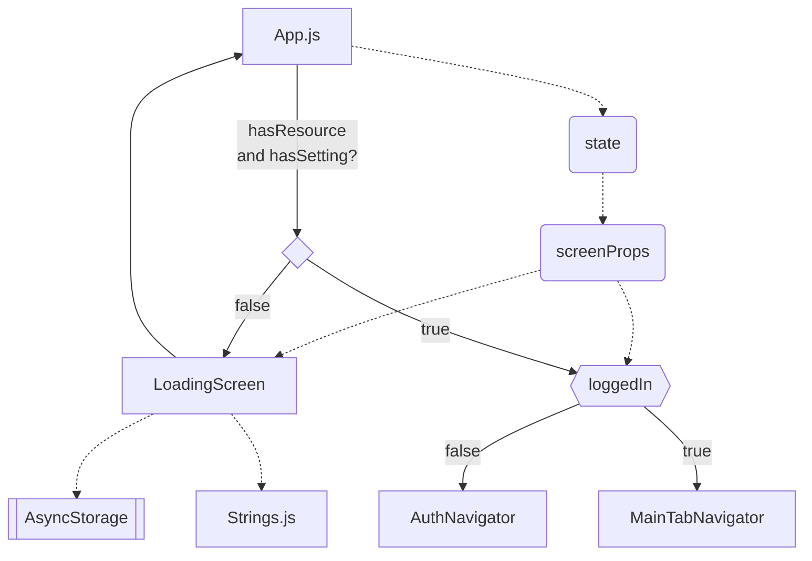

# Top level App structure

```mermaid
graph TD
    App.js -- hasResource <br/>and hasSetting? --> hasRnS{ }
    App.js -.-> s(state) -.-> sp(screenProps)
    sp -.-> LoadingScreen
    sp -.-> loggedIn
    hasRnS -- false --> LoadingScreen
    hasRnS -- true --> loggedIn{{loggedIn}}
    LoadingScreen -.-> AS[[AsyncStorage]]
    LoadingScreen -.-> Strings.js
    LoadingScreen --> App.js
    loggedIn -- false --> AuthNavigator
    loggedIn -- true --> MainTabNavigator
```
