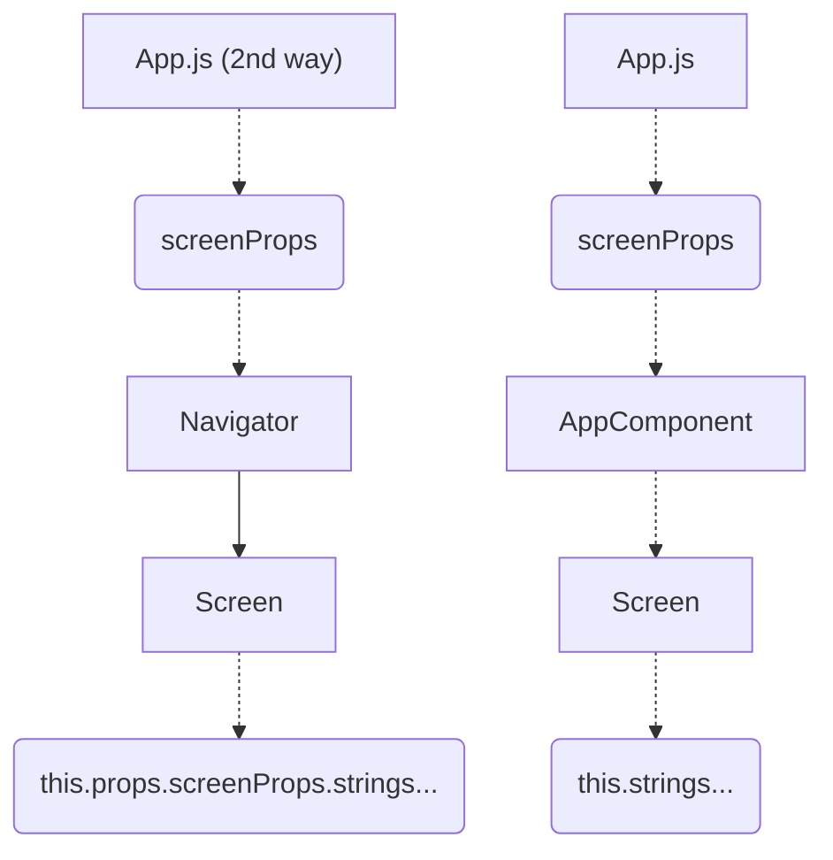

# Localization (The part where the technical debt should be repaid asap)

```mermaid
graph TD
    App.js -.-> sp(screenProps)
    sp -.-> AppComponent
    AppComponent -.-> Screen
    Screen -.-> str(this.strings...)

    2["App.js (2nd way)"] -.-> sp2(screenProps)
    sp2 -.-> Navigator
    Navigator --> Screen2[Screen]
    Screen2[Screen] -.-> str2(this.props.screenProps.strings...)
```
