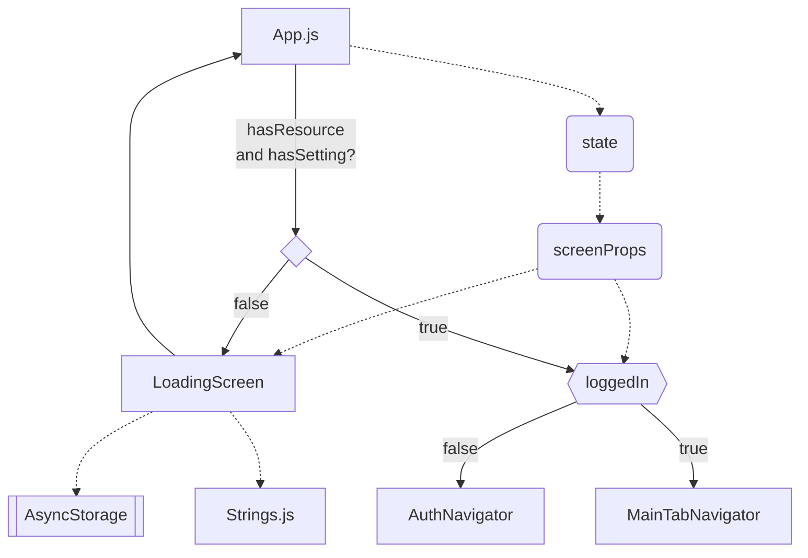

# Architecture

The diagrams are rendered using mermaid or draw.io. 

For *.md files, they are using mermaid, install the [`Markdown Preview Mermaid Support`](https://marketplace.visualstudio.com/items?itemName=bierner.markdown-mermaid) extension in vscode. To view the markdown file with the mermaid diagrams, use `>Markdown: Open Preview to the Side` or `ctrl K + V`.

For how to use mermaid, see https://mermaid-js.github.io/mermaid/#/

For *.xml files, they are using draw.io, please open it in draw.io.

## Notation

- Rectangle: Screen or Navigator
- Diamond: Decision
- double-struck vertical edges rectangle: Package
- Rounded corner: Others
- Solid line: navigation/action
- Dotted line: dependency/inheritance

## Top level App structure ([App](App.md))

## Other documentation

- [Localization](Localization.md)
- [AuthNavigator](AuthNavigator.md)
- [MainTabNavigator](MainTabNavigator.md)
- [Verify](Verify.md)
- [Modify](Modify.xml)
- [Record](Record.md)
- [Setting](Setting.md)
