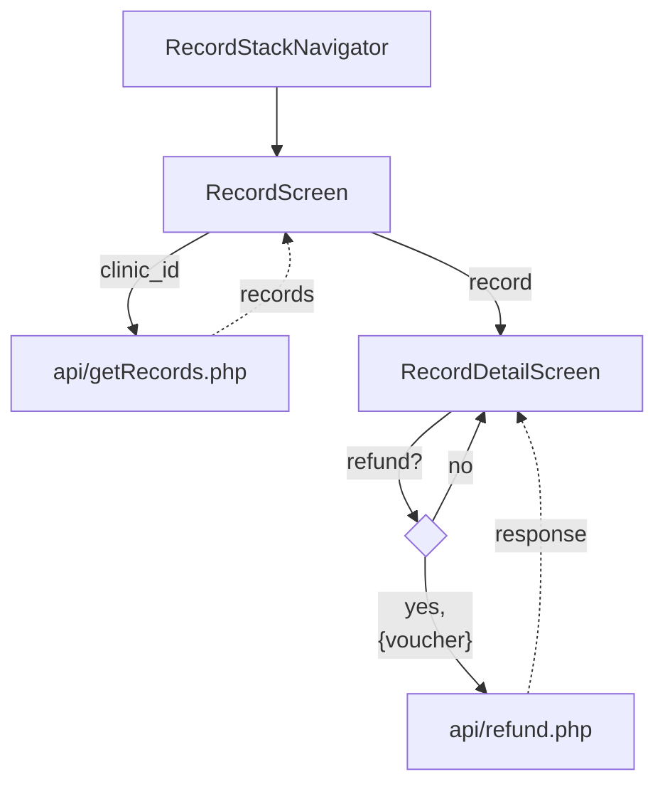

# Record

```mermaid
graph TD
    RecordStackNavigator --> RecordScreen
    RecordScreen -- clinic_id --> api/getRecords.php
    api/getRecords.php -. records .-> RecordScreen
    RecordScreen -- record --> RecordDetailScreen
    RecordDetailScreen -- refund? --> refund{ }
    refund -- no --> RecordDetailScreen
    refund -- "yes,<br/>{voucher}" --> api/refund.php
    api/refund.php -. response .-> RecordDetailScreen
```
