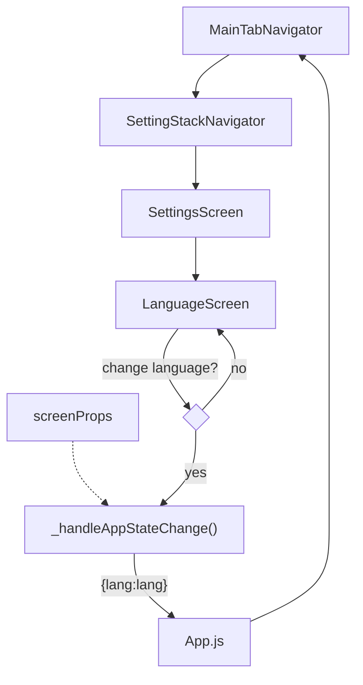

# Setting: change language (refactor this too! after repaying the localization technical debt)

```mermaid
graph TD
    MainTabNavigator --> SettingStackNavigator
    SettingStackNavigator --> SettingsScreen
    SettingsScreen --> LanguageScreen
    LanguageScreen -- change language? --> changeLang{ }
    screenProps -.-> h["_handleAppStateChange()"]
    changeLang -- no --> LanguageScreen
    changeLang -- yes --> h
    h -- "{lang:lang}" --> App.js --> MainTabNavigator
```
